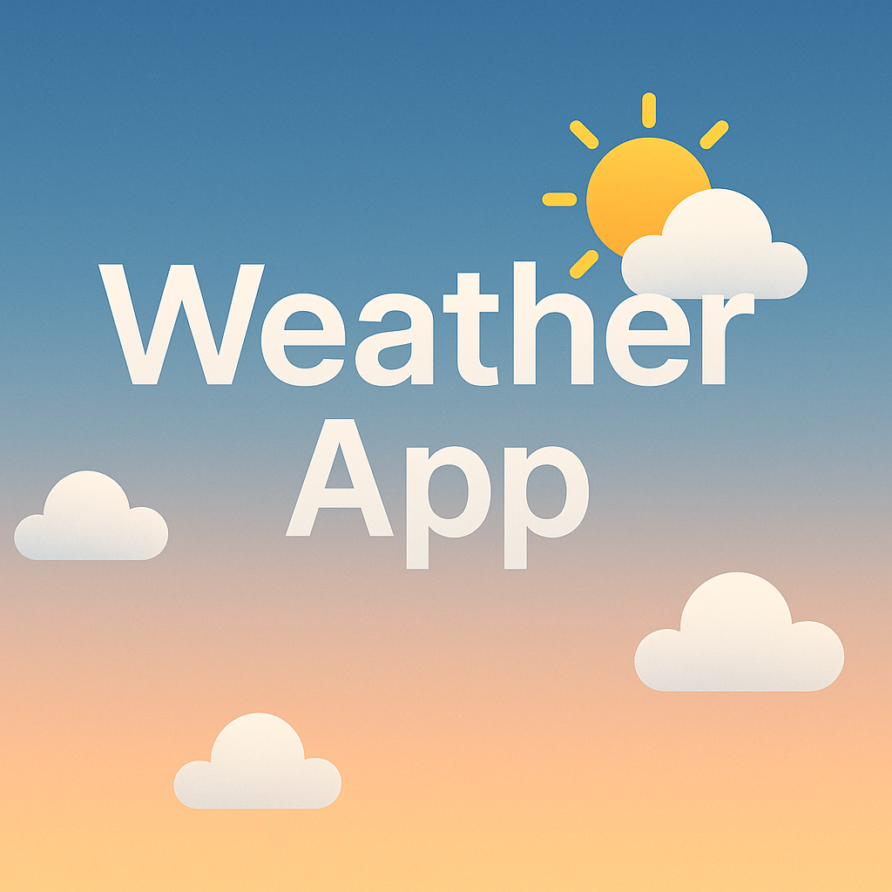

# 🌦️ Weather App

A **Spring Boot web application** that displays real-time weather based on the selected city.  
Enter a city name → choose the correct one from suggestions → get accurate weather data by coordinates.

---

## 🛠️ Technologies Used

- Java 17
- Spring Boot 3.2
- Thymeleaf (HTML templating)
- OpenWeatherMap API (Geocoding + Weather)
- Maven
- Gson
- Vanilla CSS

---

## 🌍 How It Works

1. User enters a city name (e.g., `Odessa`)
2. The app calls the **OpenWeather Geocoding API** and returns multiple matching locations
3. User selects the correct location (e.g., `Odessa, UA` or `Odessa, TX, US`)
4. The app fetches and displays weather data using **latitude & longitude**

---

## 🚀 Getting Started

```bash
git clone https://github.com/KaterynaRakova/weather-app.git
cd weather_app
./mvnw spring-boot:run